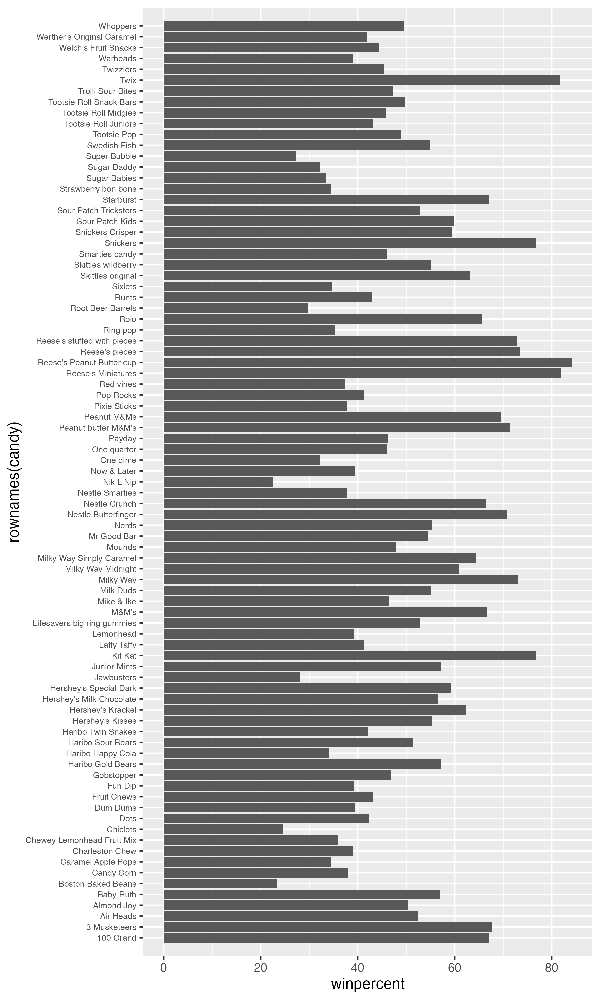
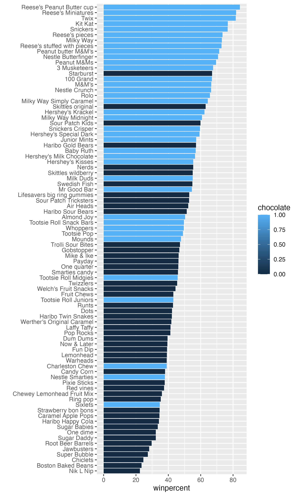

## Importing Candy Data

We start by getting data from FiveThirtyEights' GitHub repo, and reading it in and making a dataframe for it

```{r}
candydata <- read.csv("candy-data.csv")

candy <-  data.frame(candydata, row.names = 1)
head(candy)
```

>Q1. How many different candy types are in this dataset?

there are `r nrow(candy)` rows in this dataset

```{r}
nrow(candy)
```
there are 85 different types of candy

>Q2. How many fruity candy types are in the dataset?

```{r}
sum(candy$fruity)
```
there are `r sum(candy$fruity)` fruity candies

```{r}
candy["Twix", ]$winpercent
```

```{r}
library(dplyr)

candy |> 
  filter(row.names(candy)=="Twix") |> 
  select(winpercent)
```

>Q3. What is your favorite candy (other than Twix) in the dataset and what is it’s winpercent value?

```{r}
candy["100 Grand", ]$winpercent
```

100 Grand and it has a winpercent of 66.97173

>Q4. What is the winpercent value for “Kit Kat”?

```{r}
candy["Kit Kat", ]$winpercent
```
Kit Kat has a winpercent value of 76.7686

>Q5. What is the winpercent value for “Tootsie Roll Snack Bars”?

Toostie Roll has a winpercent value of `r candy["Tootsie Roll Snack Bars",]$winpercent`

```{r}
library("skimr")
skim(candy)
```

>Q6. Is there any variable/column that looks to be on a different scale to the majority of the other columns in the dataset?

Yes, winpercent operates on a much larger scale than the rest of the data in the skim function. The rest operate on a 0-1 scale whereas winpercent looks like it goes 0-100.

>Q7. What do you think a zero and one represent for the candy$chocolate column?

0 represents not liking chocalate candy whereas 1 represents liking chocolate candy.

>Q8. Plot a histogram of winpercent values using both base R an ggplot2.

```{r}
rcandyhist <- hist(candy$winpercent)
```

```{r}
library(ggplot2)

ggcandyhist <- ggplot(candy, aes(x = winpercent)) +
  geom_histogram(bins=10)
ggcandyhist
```


>Q9. Is the distribution of winpercent values symmetrical?

Not quite, there is a slight left skew.

>Q10. Is the center of the distribution above or below 50%?

```{r}
summary(candy$winpercent)
```


below 50%, median is at 47.83

>Q11. On average is chocolate candy higher or lower ranked than fruit candy?

Steps to solve this:
1. Find all choclate candy in the dataset
2. extract or find their winpercent values
3. calculate the mean of these values

4. find all fruit candy
5. find their winpercent values
6. calculate their mean value

```{r}
head(candy)
choco <- candy[candy$chocolate==1,]
choco.win <- choco$winpercent
fruit <- candy[candy$fruity==1,]
fruit.win <- fruit$winpercent
mean(choco.win)
mean(fruit.win)
t.test(choco.win, fruit.win)
```
Chocolate candy is ranked higher than chocolate candy

>Q12. Is this difference statistically significant?

Yes, p = smaller than .05 so null can be rejected. meaning it is statistically significant.

>Q13. What are the five least liked candy types in this set?

```{r}
inds <- order(candy$winpercent)
head(candy[inds,], 5)

```
Nik-L-Nip, Boston Baked Beans, Chiclets, Super Buble, Jawbusters.

>Q14. What are the top 5 all time favorite candy types out of this set?

```{r}
tail(candy[inds,], 5)
```
Snickers, Kit Kat, Twiz, Reese's Miniatures, Resse's Peanut Butter cup

>Q15. Make a first barplot of candy ranking based on winpercent values.

```{r}
ggplot(candy) +
  aes(winpercent, rownames(candy)) +
  geom_col() +
  theme(axis.text.y = element_text(size = 6)) +
  scale_y_discrete(expand = expansion(mult = .02))


ggsave("barplot1.png", height = 10, width = 6)
```


>Q16. This is quite ugly, use the reorder() function to get the bars sorted by winpercent?

```{r}
ggplot(candy) +
  aes(winpercent,
      reorder(rownames(candy), winpercent)) +
  geom_col() +
    ylab("")

ggsave("barplot2.png", height = 10, width = 6)
```


##Times to add some useful color


```{r}
ggplot(candy) +
  aes(winpercent,
      reorder(rownames(candy), winpercent), fill = chocolate) +
  geom_col() +
    ylab("")

ggsave("barplot2.png", height = 10, width = 6)
```

I want custom colors that I pick so we need to makes this ourselves...

```{r}
my_cols <- rep("black", nrow(candy))
my_cols[candy$chocolate ==1 ] <- "chocolate"
my_cols[candy$bar == 1] <- "red"
my_cols[candy$fruity == 1] <- "pink"
my_cols
```

```{r}
ggplot(candy) +
  aes(winpercent,
      reorder(rownames(candy), winpercent), fill = chocolate) +
  geom_col(fill = my_cols) 
```

>Q17. What is the worst ranked chocolate candy?

Sixlets

>Q18. What is the best ranked fruity candy?

Starbursts

## Taking a look at pricepercent

We can use the **ggrepel** package for better label placement:
```{r}
library(ggrepel)

# How about a plot of win vs price
ggplot(candy) +
  aes(winpercent, pricepercent, label=rownames(candy)) +
  geom_point(col=my_cols) + 
  geom_text_repel(col=my_cols, size=3, max.overlaps = 10)
```

>Q19. Which candy type is the highest ranked in terms of winpercent for the least money - i.e. offers the most bang for your buck?

Reese's Miniature

>Q20. What are the top 5 most expensive candy types in the dataset and of these which is the least popular?

```{r}
ord <- order(candy$pricepercent, decreasing = TRUE)
head( candy[ord,c(11,12)], n=5 )
```
Nik L Nip, Nestle Smarties, Ring pop, Hershey's Krackel, Hershey's Milk Chocolate. Nik L Nip's are the least popular.
## Exploring the correlation structure

Pearson correlation values range from -1 to +1
```{r}
library(corrplot)

cij <- cor(candy)
corrplot(cij)
```
```{r}
cor(candy)
```

>Q22. Examining this plot what two variables are anti-correlated (i.e. have minus values)?

Fruity and chocolate candy.

>Q23. Similarly, what two variables are most positively correlated?

Chocolate and Bar


##Principal Component Analysis

```{r}
pca <- prcomp(candy, scale = T)
summary(pca)
```

The main results figure: the PCA score plot:


```{r}
ggplot(pca$x) +
  aes(PC1,PC2, label=rownames(pca$x)) +
  geom_point(col = my_cols) +
  geom_text_repel(col=my_cols, max.overlaps = 34) +
  labs(title="PCA Candy Space Map", subtitle = "seperation of candies")
```
The "loadings" plot for PC1
```{r}
ggplot(pca$rotation) +
  aes(x = PC1, y = reorder(rownames(pca$rotation), PC1)) +
  geom_col()
```
```{r}
#library(plotly)
#ggplotly(p)
```


>Q24. Complete the code to generate the loadings plot above. What original variables are picked up strongly by PC1 in the positive direction? Do these make sense to you? Where did you see this relationship highlighted previously?

Fruity, Pluribus and hard are all picked up strongly positively in PC1

>Q25. Based on your exploratory analysis, correlation findings, and PCA results, what combination of characteristics appears to make a “winning” candy? How do these different analyses (visualization, correlation, PCA) support or complement each other in reaching this conclusion?

Chocolate & Caramel, Fruity & Pluribas, Fruity & Hard. PCA visualization puts the candies into visualizable groups, showing what candies share characteristics and which ones differ. The correlation analyses gives numerical values to how strong two factors are associated with each other and whether they contribute positively or negatively to each others likeability. 