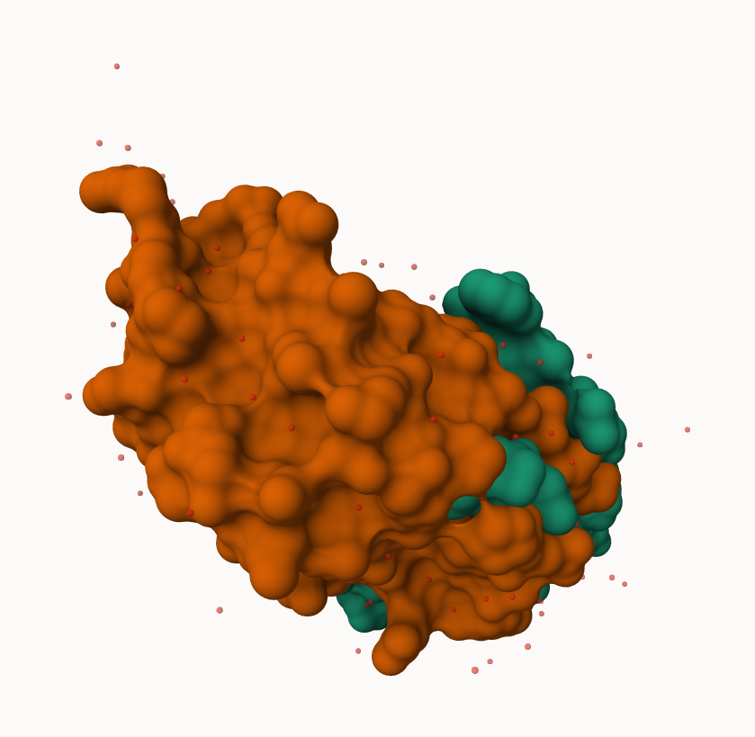
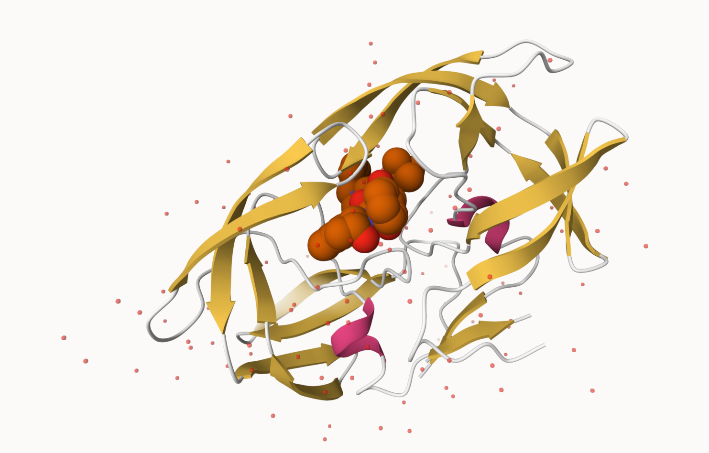
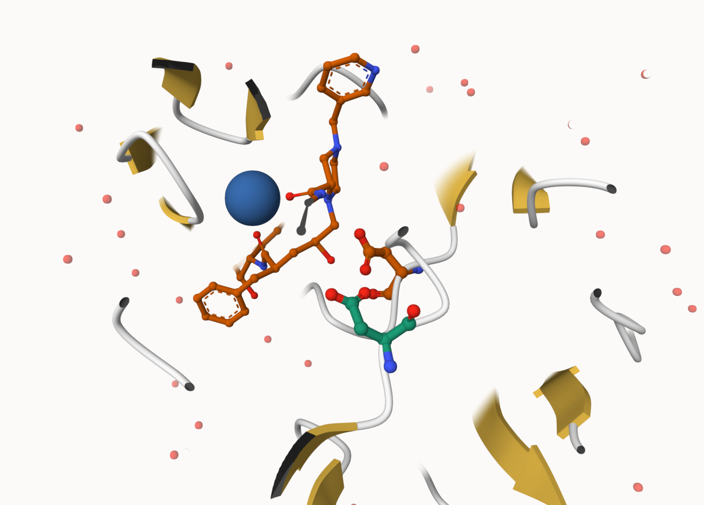

## PDB statistics

The [Protein Data Bank (PDB)](http://www.rcsb.org/) is the main repository of biomolecular structure data. Lets see what is in it:

```{r}
stats <- read.csv("pdb_stats.csv", row.names = 1)
head(stats)
```
>Q1: What percentage of structures in the PDB are solved by X-Ray and Electron Microscopy.

```{r}
n.sums <- colSums(stats)
n <- n.sums/n.sums["Total"]
round(n, digits = 2)
```

94 percent of structures are solved by X-ray and Electron Microscopy

> What is the total number of entries in the PDB?

there are `r n.sums["Total"]` structures in the PDB

```{r}
n.sums["Total"]
```


>Q2: What proportion of structures in the PDB are protein?

```{r}
sum(stats[,1:3])/sum(stats["Total"])
```
`r sum(stats[,1:3])/sum(stats["Total"])` percent of structures in the PDB are protein.

## Using Molstar

We can use the main [Molstar viewer online](https://molstar.org/viewer/)



>Q. Generate and insert an image of the HIV-Pr cartoon colored by secondary structure, showing the inhibitor (ligand) in spacefilling.


>Q4: Water molecules normally have 3 atoms. Why do we see just one atom per water molecule in this structure?

The program set water molecules as a single point to remove clutter from the image. When 3 atoms are used the image becomes busier and harder to understand what is being shown.

>Q5: There is a critical “conserved” water molecule in the binding site. Can you identify this water molecule? What residue number does this water molecule have

Yes, I can tell the water sits near a phenylalanine but I cannot see which residue number it is.

>Q6. One final image showing catalytic APS 25 as ball and stick and the billion dollar water molecule as space filling


## The Bio3D package for structual bioinformatics

```{r}
library(bio3d)

hiv <- read.pdb("1HSG")
hiv
```

```{r}
head(hiv$atom)
pdbseq(hiv)
```

Let's try out the new **bio3dview** package that is not yet on CRAN.
We can use the **remotes** package to install any R package from GitHub.

### Quick viewing of PDBs

```{r}
library(bio3dview)

sele <- atom.select(hiv, resno=25)

#view.pdb(hiv, backgroundColor = "lightblue",
#         highlight = sele,
#         highlight.style = "spacefill")
```

### Prediction of Protein Flexibility

```{r}
#perform flexibility prediction
adk <- read.pdb("6s36") #reads Adenylate Kinase
adk
m <- nma (adk) #mathmatically calculates the flexibility
plot(m) #plots the flexibility calculations
```

Write our results as a wee trajectory:

```{r}
mktrj(m, file = "results.pdb") # wrote out the results
```

```{r}
#view.nma(m)
#view.nma()
```

## Comparitive Analysis

Rtn to HTML format!

1. `get.seq()` Identifies which database the protein is pulled from - Uses FASTA Format for protin
2. `blast.pdb()` Searches the PDB Database then, `get.pdg()` searches the Homologous Stucture Sets - Finds and downloads all related structures to your protein from step 1.
3. `pdbaln()` Aligns & superimposes all structures - Aligns sequences and related structures
4. `pca()` Creates Score plot(Conformer plot) & Loadings (displacement trajectory) Plot

1. We'll start with a database id

```{r}
library(bio3d)

id <- "1ake_A"
aa <- get.seq(id)
```
2A. 
```{r}
blast <- blast.pdb(aa)
```

Have a wee peak:
```{r}
head(blast$hit.tbl)
```

```{r}
hits <- plot(blast)
```
Peak at our "top hits"
```{r}
head(hits$pdb.id)
```
Now we can download these "top hits". These will all be ADK (Adenylate Kinase) structures in the PDB database.
2B.
```{r}
files <- get.pdb(hits$pdb.id, path="pdbs", split=T, gzip=T)
```
We use `BioConductor`, which is an open source software for Bioinformatics `https://www.bioconductor.org`
We need one package from BioConductor. To set this up, we need to first install a package called **"BiocManager"** from CRAN.

Now we can use the `install()` function from this package like this:
`BiocManager::install("msa")` <- Run in Console to load ONLY the install function from BiocManager. - Saves ram to load only 1 library. `::` notation means load only 1 function from specified package.

```{r}
pdbs <- pdbaln(files, fit = T, exefile="msa")
```
Let's have a wee peak at our structures after "fitting" or superimposing:

```{r}
library(bio3dview)
view.pdbs(pdbs,)
```
```{r}
view.pdbs(pdbs, colorScheme = "residue")
```
We can run functions like `rmsd()`, `rmsf()`, and the best `pca()`
```{r}
pc.xray <- pca(pdbs)
plot(pc.xray)
```
```{r}
plot(pc.xray, 1:2)
```
Finally, let's make a wee movie of the major "motion" or structual difference in the dataset - we call this a "trajectory"

```{r}
mktrj(pc.xray, file = "results.pdb")

```


